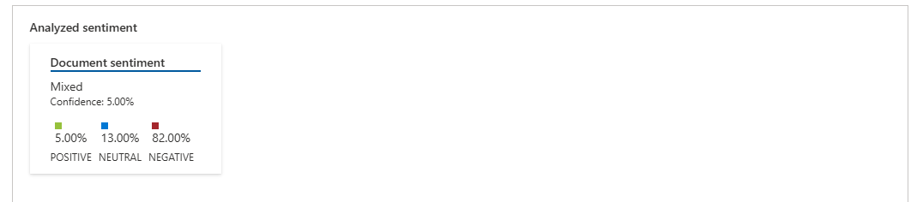
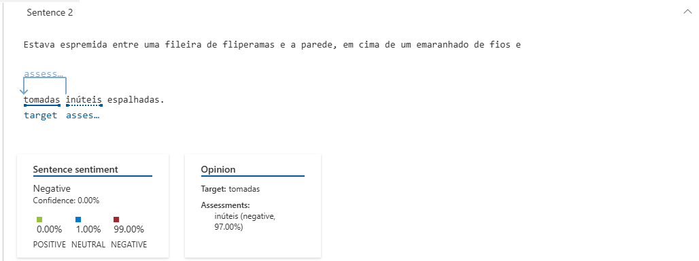

# Lab Project 03 - Análise de sentimentos com Language Studio no Azure AI
**Sentiment and opinion mining** é uma solução da plataforma **Language Studio, da Azure**, que permite **detectar sentimentos positivos, negativos e neutros** a partir de sentenças. Esse repositório mostra alguns exemplos de testes na plataforma. Os procedimentos foram realizados como parte do **Bootcamp Microsoft Azure AI Fundamentals, da DIO**

## Procedimento
Esses experimentos foram baseados nos guias da Microsoft Learn. Para informações mais detalhadas, consulte a página Analyze text with Language Studio.

### Criar um recurso Azure Language Service
Para ser possível usar o Language Studio, é essencial que você possua um recurso para a plataforma associado a sua conta Azure. Isso pode ser feito por meio dos seguintes passos:
1. Acessar https://portal.azure.com
2. Criar um novo recurso **Language Service** através da opção Create Resource.
3. Esperar o *deploy* do recurso terminar.

### Selecionar recurso no Language Studio
Com o recurso Language Service criado, é preciso conecta-lo ao Language Studio. Para isso, basta seguir os seguintes passos:

1. Acessar o [Language Studio](https://language.cognitive.azure.com/home).
2. Na página inicial, acessar os recursos criados através do botão "Select a resouce".
3. Preencha as informações e selecione o recurso recém criado.
4. 
### Selecionando e testando o serviço no Language Studio
Ao retornar a página inicial após concluídos os passos anteriores, é possível ver a lista de serviços disponíveis para teste na plataforma. Nesse experimento foi usado o serviço "Analyze sentiment and mine opinions", na aba "Classify text".

## Resultados
Ao acessar o serviço é possível carregar o texto a ser analisado, selecionar sua linguagem e também ativar a opção de opinion mining. Para esse experimento, selecionei um capítulo do livro Five Night At Freddy's Olhos Prateados. 

    

### 📈 Dados Quantitativos
A ferramenta Azure Language Studio classificou o texto do livro *Five Nights at Freddy's: Olhos Prateados* com a seguinte distribuição:

| Sentimento | Porcentagem | Ícone | Observação |
|------------|-------------|-------|------------|
| **Negativo** | 82% | 😨 | Cenas de terror e suspense |
| **Neutro** | 13% | 😐 | Descrições de ambiente |
| **Positivo** | 5% | 🙂 | Momentos breves de alívio |

    

Abaixo é possível observar a funcionalidade de *opinion mining* funcionando:

    

## Conclusão e Insights
Esses resultados sugerem que, enquanto a solução é eficaz para identificar sentimentos explícitos em frases individuais (ótimo para análises de reviews ou pesquisas), ela tem limitações significativas quando aplicada a textos narrativos mais complexos, onde o significado emocional emerge da combinação de elementos e do contexto geral.
